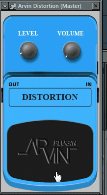

# Distortion Pedal dengan Delphi 7

Ini adalah proyek pedal distorsi sederhana yang dikembangkan menggunakan Delphi 7. Pedal distorsi ini memungkinkan Anda untuk mengubah suara gitar Anda dengan menambahkan efek distorsi.

## Fitur

- **Distorsi**: Efek distorsi yang dapat disesuaikan untuk mengubah karakter suara gitar.
- **Tingkat Gain**: Mengatur sejauh mana distorsi diterapkan ke sinyal gitar.
- **Antarmuka Pengguna Sederhana**: Antarmuka pengguna yang mudah digunakan untuk mengontrol pedal distorsi.

## Persyaratan

- Delphi 7 atau versi yang lebih tinggi.
- Kompatibel dengan sistem operasi Windows.

## Penggunaan

1. Buka proyek dalam Delphi 7.
2. Kompilasi proyek untuk membuat eksekusi.
3. Jalankan eksekusi pedal distorsi.
4. Hubungkan gitar Anda ke komputer Anda menggunakan antarmuka audio yang sesuai.
5. Sesuaikan pengaturan level dan volume sesuai keinginan Anda.

## Kontribusi

Kami sangat menghargai kontribusi Anda untuk proyek ini. Jika Anda ingin berkontribusi, silakan buat _pull request_ dan kami akan mempertimbangkan untuk menggabungkannya.

## Lisensi

Proyek ini dilisensikan di bawah lisensi MIT. Lihat [LISENSI](LISENSI.md) untuk informasi lebih lanjut.

## Dukungan

Jika Anda memiliki pertanyaan atau masalah terkait proyek ini, silakan buka _issue_ di repositori ini atau hubungi kami melalui [fajarjlyana1@gmail.com](mailto:fajarjulyana1@gmail.com ).

Terima kasih telah menggunakan pedal distorsi Delphi 7!

